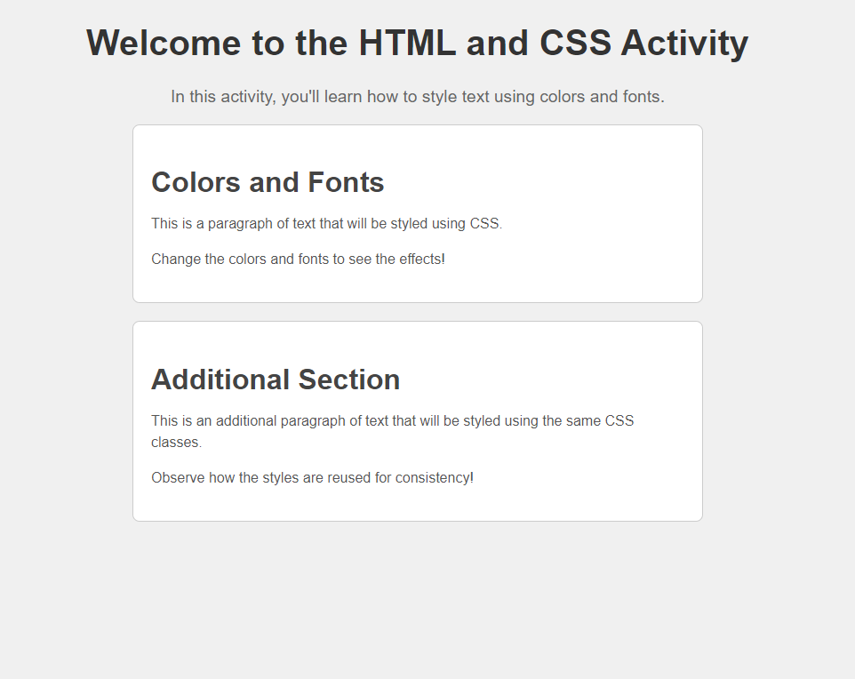

# Colors and Fonts



---

## Description

This activity is designed to help students learn how to style HTML elements using CSS, specifically focusing on colors and fonts. You will use hexadecimal values to set colors and will experiment with different font properties.

---

## Learning Outcomes

1. Apply CSS to style HTML elements.
2. Use hexadecimal values to set colors.
3. Change font properties such as size, family, and alignment.

---

## ToDo list ✅
**Attention**: When you complete a task, put an `x` in the middle of the brackets to mark it off your ToDo list. Note: all work to be done in the `styles.css` file.

[ ] In `stlyes.css` set the background color of the `body` to a light gray (`#f0f0f0`):
```css
body {
  color: #f0f0f0;
}
```

[ ] Change the font of the entire document to `Arial, sans-serif`:
```css
body {
  color: #f0f0f0;
  font-family: Arial, sans-serif;
}
```

[ ] Update the `main-title` id to have a dark gray color (#333333), a font size of 2.5em, and center alignment:
```css
#main-title {
  color: #333333;
  font-size: 2.5em;
  text-align: center;
}
```

[ ] Update the `description` id to have a medium gray color (#666666), a font size of 1.2em, and center alignment:
```css
#description {
  color: #666666;
  font-size: 1.2em;
  text-align: center;
}
```

[ ] Style the `.content` class with the following properties:

- Margin of 20px auto
- Maximum width of 600px
- Padding of 20px
- Background color of white (#ffffff)
- Border with a light gray color (#cccccc)
- Border radius of 8px
```css
.content {
  margin: 20px auto;
  max-width: 600px;
  padding: 20px;
  background-color: #ffffff;
  border: 1px solid #cccccc;
  border-radius: 8px;
}
```

[ ] Update the `.section-title` class to have a slightly darker gray color (#444444), a font size of 2em, and a margin-bottom of 10px:
```css
.section-title {
  color: #444444;
  font-size: 2em;
  margin-bottom: 10px;
}
```

[ ] Style the `.text` class with a gray color (#555555), a font size of 1em, and a line height of 1.5:
```css
.text {
  color: #555555;
  font-size: 1em;
  line-height: 1.5;
}
```

[ ] Now let's add another html section and some content. Observe how we can reuse our previous CSS by using the same classes we created before.
```html
<section class="content">
    <h2 class="section-title">Additional Section</h2>
    <p class="text">This is an additional paragraph of text that will be styled using the same CSS classes.</p>
    <p class="text">Observe how the styles are reused for consistency!</p>
</section>
```
